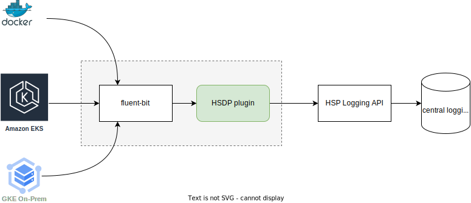

# fluent bit HSDP logging output plugin

This plugin outputs your logs to the HSDP Host Logging service. This is useful when your workloads are not running on Cloud foundry, but you still want to utilize the central logging facilities of HSDP. 

  

Fluent bit supports parser and filter plugin which can convert unstructured data gathered from the log Input interface into a structured one and to alter existing structured data before ingestion.

[More on fluent-bit](https://fluentbit.io/documentation/0.14/getting_started/)

## Cloud and On-Premise

The plugin supports deployment to both Cloud and On-Premise environments. Depending on 
the deployment type you can either specify the Cloud `Region` and `Environment` or the On-Premise
`IamUrl` and `IdmUrl` values.

## API Signing, Service Identities or Logdrainer

The plugin supports both the API Signing authorization mechanism or the use
of a IAM Service Identity with the `LOG.CREATE` scope. It also supports using a CF Logdrain endpoint 
although that limits the log format output (e.g. no support for the `custom` field)

## Configuration options
Your `fluent-bit.conf` file should include an entry like below to enable the plugin:

```
[output]
    Name hsdp
    Match *
```

Configuring the authorization mechanism and HSDP Logging endpoints should ideally
be done by setting the right Environment variables:

## Settings

### General

These keys are relevant when using either SigningKey or Service identities

| Key                | Description                                          | Environment variable         | Required |
|--------------------|------------------------------------------------------|------------------------------|----------|
| ProductKey         | The Product key of your proposition                  | HSDP\_PRODUCT\_KEY           | Required |
| Region             | The HSP Region (Cloud)                               | HSDP\_REGION                 | Required |
| Environment        | THE HSP Environment (Cloud)                          | HSDP\_ENVIRONMENT            | Required |
| IamUrl             | The IAM URL (On-Premise)                             | HSDP\_IAM\_URL               | Optional |
| IdmUrl             | The IDM URL (On-Premise)                             | HSDP\_IDM\_URL               | Optional |
| IngestorHost       | The HSDP ingestor host                               | HSDP\_INGESTOR\_HOST         | Optional |
| Debug              | Shows request details when set to true               | HSDP\_DEBUG                  | Optional |
| CustomField        | Adds the field hash to custom field when set to true | HSDP\_CUSTOM\_FIELD          | Optional |
| InsecureSkipVerify | Skip checking HSDP ingestor TLS cert. Insecure!      | HSDP\_INSECURE\_SKIP\_VERIFY | Optional |
| SynchronousFlush   | Flushes log messages synchronously without batching. By default this is set to *false*  |   | Optional |
| RetryOnError       | Returns retry to FLB if flush fails. Applicable only when *SynchronousFlush* option is set. By default this is set to *false* | | Optional | 
| Proxy              | HTTP Proxy URL in case there is a proxy redirection required             |  | Optional |

### Signing keys

| Key       | Description                         | Environment variable | Required |
|-----------|-------------------------------------|----------------------|----------|
| SharedKey | The Shared key for signing requests | HSDP\_SHARED\_KEY    | Optional |
| SecretKey | The Secret key for signing requests | HSDP\_SECRET\_KEY    | Optional |

### Service identities

| Key               | Description                              | Environment variable        | Required |
|-------------------|------------------------------------------|-----------------------------|----------|
| ServiceId         | The Service ID to use for authentication | HSDP\_SERVICE\_ID           | Optional |
| ServicePrivateKey | The Service private key                  | HSDP\_SERVICE\_PRIVATE\_KEY | Optional |

### Logdrain

You can reuse an existing Cloud foundry logdrainer endpoint to ship your logs to HSDP logging. The advantage is
that you only need the Logdrain URL itself, no other configuration. This URL is considered
a credential so care should be taken to protect it though.

| Key                     | Description                 | Environment variable           | Required |
|-------------------------|-----------------------------|--------------------------------|----------|
| LogdrainUrl             | The HSP Logdrain URL        | HSDP_LOGDRAIN_URL              | Optional |
| LogdrainApplicationName | The Application name to use | HSDP_LOGDRAIN_APPLICATION_NAME | Optional |
| LogdrainServerName      | The Server name to use      | HSDP_LOGDRAIN_SERVER_NAME      | Optional |

> Environment variable values take precedence over those in configuration files.

## Record field mapping to HSDP logging resource

The plugin supports full pass-through of the native `LogEvent` JSON message type, example:

```json
{
  "resourceType": "LogEvent",
  "id": "7f4c85a8-e472-479f-b772-2916353d02a4",
  "applicationName": "OPS",
  "eventId": "110114",
  "category": "TRACELOG",
  "component": "TEST",
  "transactionId": "2abd7355-cbdd-43e1-b32a-43ec19cd98f0",
  "serviceName": "OPS",
  "applicationInstance": "INST‐00002",
  "applicationVersion": "1.0.0",
  "originatingUser": "SomeUsr",
  "serverName": "ops-dev.cloud.pcftest.com",
  "logTime": "2017-01-31T08:00:00Z",
  "severity": "INFO",
  "logData": {
    "message": "VGVzdCBNZXNzYWdl"
  },
  "custom": {
    "foo": "bar"
  }
}
```

> **NOTE**: the `logData.message` field must be [base64 encoded](https://www.hsdp.io/documentation/logging/api-documents/log-event-api/log-event-api)

### field mapping

Alternatively, the plugin maps certain record fields to defined HSDP logging resource fields. The below
table shows the mapping, and the default value.

| Record field       | HSDP logging field  | Default value | Details |
|--------------------|---------------------|---------------|-----------------------|
| server\_name       | serverName          | fluent-bit    ||
| app\_name          | applicationName     | fluent-bit    ||
| app\_instance      | applicationInstance | fluent-bit    ||
| app\_version       | applicationVersion  | 1.0           ||
| category           | category            | TraceLog      ||
| severity           | severity            | informational ||
| service\_name      | service\_name       | fluent-bit    ||
| originating\_user  | originating\_user   | fluent-bit    ||
| event\_id          | event\_id           | 1             ||
| transaction\_id    | transaction\_id     | random UUID   |if original input is not a valid UUID a new one will be generated|
| trace\_id          | trace\_id           |               ||
| span\_id           | span\_id            |               ||
| logdata\_message   | logData.Message     | field hash    |will replace the default field hash dump went present|

> Fields mapped to a HSDP logging resource field will be removed from the log message dump

The below filter definition shows an example of assigning fields

```yaml
[filter]
    Name record_modifier
    Match *
    Record server_name ${HOSTNAME}
    Record service_name Awesome_Tool
```

```yaml
[filter]
    Name modify
    Match *
    Rename container_name app_name
    Rename container_name service_name
    Rename component_name component
    Rename container_id app_instance
```

> Remaining fields will be rendered to a JSON hash and assigned to `logData.Message`

## Building

```shell
docker build -t fluent-bit-out-hsdp .
```

## Testing with Docker

```shell
docker run --rm \
    -p 127.0.0.1:24224:24224 \
    -e HSDP_PRODUCT_KEY=product-key-here \
    -e HSDP_REGION=us-east \
    -e HSDP_ENVIRONMENT=client-test \
    -e HSDP_SERVICE_ID=my.service.id@app.prop.philips-healthsuite.com \
    -e HSDP_SERVICE_PRIVATE_KEY="$(cat service_private_key.pem)" \
    -it ghcr.io/philips-software/fluent-bit-out-hsdp:latest
```

Once the above is running you can start other Docker containers and 
use fluentd log driver to start logging to HSDP logging:

```shell
docker run --rm -it --log-driver fluentd alpine echo "hello world"
```

## Helm Chart

You can deploy fluent-bit and the HSDP plugin using a Helm chart

### Secret

The chart will attempt to read credentials from an `hsdp-logging` Kubernetes secret which should reside
in the namespace. An example `hsdp-logging-secret.yaml` is included below. Make sure you replace the values accordingly.

> **_NOTE:_**  All the values should be in the base64 encoded.

```yaml
apiVersion: v1
kind: Secret
metadata:
  name: hsdp-logging
type: Opaque
data:
  shared_key: cmVwbGFjZV9tZV93aXRoX2NvcnJlY3RfdmFsdWVz
  secret_key: cmVwbGFjZV9tZV93aXRoX2NvcnJlY3RfdmFsdWVz
  product_key: cmVwbGFjZV9tZV93aXRoX2NvcnJlY3RfdmFsdWVz
  ingestor_host: aHR0cHM6Ly9sb2dpbmdlc3RvcjItY2xpZW50LXRlc3QuZXUtd2VzdC5waGlsaXBzLWhlYWx0aHN1aXRlLmNvbQ==
```

Apply the secret to the right namepace (for Fiesta this is `kube-system`):

```shell
kubectl apply -f hsdp-logging-secret.yaml -n logging
```

Add helm repo:

```shell
helm repo add philips-software https://philips-software.github.io/helm-charts/
```

Download the helm chart
```shell
helm pull philips-software/fluent-bit-out-hsdp
```

Navigate to the download Helm chart and unzip.

After unzip, open `fluent-bit-out-hsdp\values.yml` and add the enviroment details like:
```yaml
fluent-bit:
  env:
   - name: HSDP_REGION
     valueFrom:
       secretKeyRef:
         key: region
         name: hsdp-logging
         optional: true
   - name: HSDP_ENVIRONMENT
     valueFrom:
       secretKeyRef:
         key: environment
         name: hsdp-logging
         optional: true
   - name: HSDP_PRODUCT_KEY
     valueFrom:
       secretKeyRef:
         key: product_key
         name: hsdp-logging
         optional: false
   - name: HSDP_INGESTOR_HOST
     valueFrom:
       secretKeyRef:
         key: ingestor_host
         name: hsdp-logging
         optional: true
   - name: HSDP_SHARED_KEY
     valueFrom:
       secretKeyRef:
         key: shared_key
         name: hsdp-logging
         optional: true
   - name: HSDP_SECRET_KEY
     valueFrom:
       secretKeyRef:
         key: secret_key
         name: hsdp-logging
         optional: true
   - name: HSDP_SERVICE_ID
     valueFrom:
       secretKeyRef:
         key: service_id
         name: hsdp-logging
         optional: true
   - name: HSDP_SERVICE_PRIVATE_KEY
     valueFrom:
       secretKeyRef:
         key: service_private_key
         name: hsdp-logging
         optional: true
```

You can skip the unwanted fields from above yaml. For e.g, if you are going to use secret_key and shared_key based authentication, then only fields required are: 
```yaml
fluent-bit:
  env:
   - name: HSDP_PRODUCT_KEY
     valueFrom:
       secretKeyRef:
         key: product_key
         name: hsdp-logging
         optional: false
   - name: HSDP_INGESTOR_HOST
     valueFrom:
       secretKeyRef:
         key: ingestor_host
         name: hsdp-logging
         optional: true
   - name: HSDP_SHARED_KEY
     valueFrom:
       secretKeyRef:
         key: shared_key
         name: hsdp-logging
         optional: true
   - name: HSDP_SECRET_KEY
     valueFrom:
       secretKeyRef:
         key: secret_key
         name: hsdp-logging
         optional: true
```

Install the Helm chart

```shell
helm install my-fluent-bit-out-hsdp fluent-bit-out-hsdp -n logging
```

If the credentials are correct you should now see your Kubernetes cluster logs in the HSDP Logging system.

## Contact / Getting help

Andy Lo-A-Foe <andy.lo-a-foe@philips.com>

## License

License is MIT
